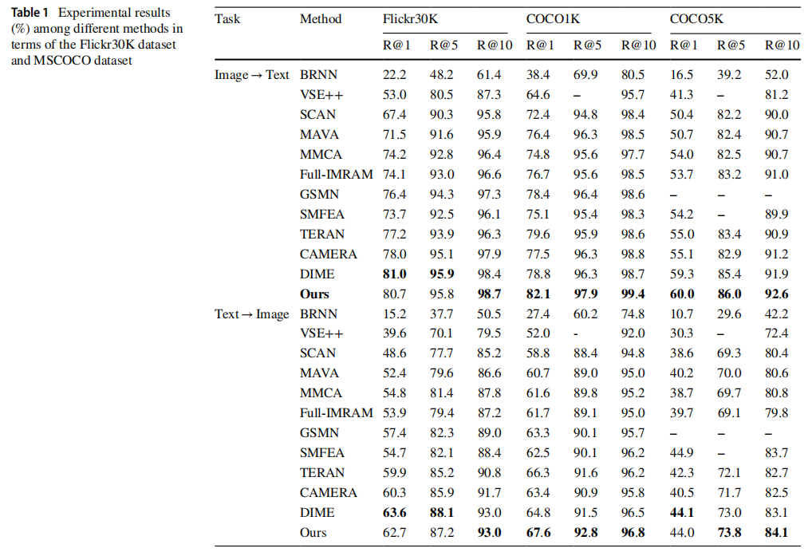

# 洪涝灾害检测及预警评估算法库
本算法库包含了一系列洪涝灾害检测及预警评估算法。

## 目录
- [DMA-YOLO: multi-scale object detection method with attention mechanism for aerial images](#dma-yolo-multi-scale-object-detection-method-with-attention-mechanism-for-aerial-images)
- [Multi-Level Network Based on Transformer Encoder for Fine-Grained Image-Text Matching](#multi-level-network-based-on-transformer-encoder-for-fine-grained-image-text-matching)
- [Manifold and Patch-Based Unsupervised Deep Metric Learning for Fine-Grained Image Retrieval](#manifold-and-patch-based-unsupervised-deep-metric-learning-for-fine-grained-image-retrieval)
- [DTSFNet: A Lightweight Network Based on Dynamic Sampling and Scale Sequence Fusion for Aerial Image Object Detection](#dtsfnet-a-lightweight-network-based-on-dynamic-sampling-and-scale-sequence-fusion-for-aerial-image-object-detection)
- [Variational Adversarial Negative Sampling for Multimodal Knowledge Graph Completion](#variational-adversarial-negative-sampling-for-multimodal-knowledge-graph-completion)
- [Fine-Grained Information Supplementation and Value-Guided Learning for Remote Sensing Image-Text Retrieval](#fine-grained-information-supplementation-and-value-guided-learning-for-remote-sensing-image-text-retrieval)

## 算法

### DMA-YOLO multi-scale object detection method with attention mechanism for aerial images
本工作对通用目标检测方法YOLOv5进行了改进，引入了一种**多尺度检测方法分离-合并注意力YOLO（Detach-Merge Attention YOLO, DMA-YOLO）**。本工作包含以下设计：
1. **分离-合并卷积（Detach-Merge Convolution, DMC）模块**，在骨干网络中使用，以最大限度地保留特征。
2. 将**瓶颈注意力模块（Bottleneck Attention Module, BAM）** 嵌入到检测头中，在不显著增加计算复杂度的情况下抑制复杂背景信息的干扰。
4. 为了更有效地表示和处理多尺度特征，将一个额外的检测头和增强的颈部网络集成到**双向特征金字塔网络（Bi-directional Feature Pyramid Network, BiFPN）** 结构中。
5. 采用**SCYLLA-IoU（SIoU）** 作为损失函数以加快模型的收敛速度、提高精度。
本工作在**VisDrone2019和UAVDT数据集**上验证了模型的效果。

* 模型效果

<div align="center">
  
</div>
<div align="center">
  
</div>


* 引用
```bibtex
@article{li2024dma,
  title={DMA-YOLO: multi-scale object detection method with attention mechanism for aerial images},
  author={Li, Ya-ling and Feng, Yong and Zhou, Ming-liang and Xiong, Xian-cai and Wang, Yong-heng and Qiang, Bao-hua},
  journal={The Visual Computer},
  volume={40},
  number={6},
  pages={4505--4518},
  year={2024},
  publisher={Springer}
}
```
* 代码请见[DMA-YOLO](DMA-YOLO.zip)

### Multi-Level Network Based on Transformer Encoder for Fine-Grained Image-Text Matching
本工作提出了一种基于**Transformer Encoder**的多级网络，用于细粒度的图像-文本匹配。首先，**采用Transformer编码器提取图像与文本的模态内关联关系**，并通过高效聚合方法实现对齐，既提升了对齐效率，又充分利用了模态内信息；其次，**捕获图像和文本中具有判别性的数字信息**以增强表征区分度；最后，将**图像与文本的全局信息**作为补充特征，进一步强化表征。实验结果表明，相较于现有最优算法，本方法在检索任务和运行时耗方面均取得显著提升。

* 模型效果



* 引用
```bibtex
@article{yang2023multi,
  title={Multi-level network based on transformer encoder for fine-grained image--text matching},
  author={Yang, Lei and Feng, Yong and Zhou, Mingliang and Xiong, Xiancai and Wang, Yongheng and Qiang, Baohua},
  journal={Multimedia Systems},
  volume={29},
  number={4},
  pages={1981--1994},
  year={2023},
  publisher={Springer}
}
```
* 代码请见[MNTE](https://github.com/CQULab/MNTE)

### Manifold and Patch-Based Unsupervised Deep Metric Learning for Fine-Grained Image Retrieval
本工作提出了一个**面向细粒度图像检索的流形与图像块联合驱动的无监督深度度量学习方法（Manifold and Patch-based Unsupervised Deep Metric Learning, MPUDML）**。首先，采用**基于流形相似度的平衡采样策略**构建更均衡的小批量样本。其次，利用**流形相似度与未标注图像间余弦相似度**获取软监督信息实现样本区分，有效降低噪声样本影响。最后，通过**图像块级聚类与定位任务**挖掘图像内部块间丰富特征信息，从而指导获取更全面的特征嵌入表征，提升检索性能。在细粒度图像检索与聚类任务中，MPUDML与多种前沿无监督深度度量学习方法进行对比验证。实验结果表明，本方法在召回率（R@K）与归一化互信息（NMI）指标上均超越其他先进方法。

* 模型效果


* 引用
```bibtex
@article{yuan2025manifold,
  title={Manifold and patch-based unsupervised deep metric learning for fine-grained image retrieval},
  author={Yuan, Shi-hao and Feng, Yong and Qiu, A and Duan, Guo-fan and Zhou, Ming-liang and Qiang, Bao-hua and Wang, Yong-heng},
  journal={Applied Intelligence},
  volume={55},
  number={2},
  pages={1--18},
  year={2025},
  publisher={Springer}
}
```
* 代码请见[MPUDML](https://pan.baidu.com/s/1o35DaX4jlXr5UyFxKlJQdw?pwd=on12)

### DTSFNet: A Lightweight Network Based on Dynamic Sampling and Scale Sequence Fusion for Aerial Image Object Detection【暂无代码】
本工作提出了一种基于动态采样和尺度序列融合的轻量级深度网络（dynamic sampling and scale sequence fusion, DTSFNet）。网络包含一个多尺度特征提取器（multiscale feature extractor, MSFE）模块，采用多种卷积核来降低模型复杂度，同时有效捕捉多尺度特征。此外，网络还包含了一个动态尺度序列融合（dynamic scale sequence fusion, DSSF）模块，对不同层级的多尺度特征进行全面探索和高效整合。本工作在三个公开可用的数据集（VisDrone2019、UVADT和DIOR）上对所提方法进行了评估。结果表明，本方法在实现轻量级模型的同时，保持了较高的检测精度。

* 模型效果


* 引用
```bibtex
@article{liao2025dtsfnet,
  title={DTSFNet: A Lightweight Network Based on Dynamic Sampling and Scale Sequence Fusion for Aerial Image Object Detection},
  author={Liao, Yanting and Feng, Yong and Chen, Yanying and Duan, Guofan and Qiang, Baohua and Lan, Zhangli and Wang, Ke and Zou, Lai and Pu, Huayan and Luo, Jun and others},
  journal={Journal of Circuits, Systems and Computers},
  pages={2550298},
  year={2025},
  publisher={World Scientific}
}
```
* 代码请见[DTSFNet]()

### Variational Adversarial Negative Sampling for Multimodal Knowledge Graph Completion
本工作提出基于变分对抗负采样的多模态知识图谱补全框架（VansKG）。该框架通过变分对抗负采样技术实现高效负样本训练，结合结构化查询与关系调节动态交叉注意力融合机制，构建以三元组为核心的多模态融合模型，显著提升整体补全效果。实验表明，VansKG在三个通用基准数据集上超越了18种先进方法，取得了最优性能表现。

* 模型效果


* 代码请见[VansKG](https://github.com/vialstar/VansKG)
  
### Fine-Grained Information Supplementation and Value-Guided Learning for Remote Sensing Image-Text Retrieval
本工作提出了一种细粒度信息补充与价值引导学习（fine-grained information supplementation and value-guided learning, FISVL）模型，通过融合推荐系统领域的先验知识进行特征增强，并采用价值导向的训练策略学习细粒度、高表达性与鲁棒性兼具的特征表示。具体而言，本工作设计了以下核心模块：
1. ​**细粒度信息补充模块（fine-grained information supplementation, FGIS）​**：通过融合全局与局部特征的视觉信息，增强模型对遥感图像多尺度特征的感知能力，解决传统方法中因特征粒度不足导致的表征局限性问题。
2. ​**双重损失优化机制**：针对模态内相似性过高的问题，提出加权对比损失（加权策略参考了样本重要性动态调整方法）与场景自适应细粒度感知损失，通过约束特征空间分布提升模型判别力。
3. ​**价值引导学习框架**：在训练阶段动态聚焦关键信息，通过自适应的注意力机制（类似场景自适应门单元设计）优化不同训练阶段的学习目标优先级，显著提升模型收敛效率。
本工作在RSICD与RSITMD数据集上验证了模型的有效性，结果表明本方法在细粒度特征学习与跨模态对齐任务中均达到领先水平。

* 模型效果
  


* 引用
```bibtex
@article{zhou2024fine,
  title={Fine-Grained Information Supplementation and Value-Guided Learning for Remote Sensing Image-Text Retrieval},
  author={Zhou, Zihui and Feng, Yong and Qiu, Agen and Duan, Guofan and Zhou, Mingliang},
  journal={IEEE Journal of Selected Topics in Applied Earth Observations and Remote Sensing},
  year={2024},
  publisher={IEEE}
}
```
* 代码请见[FISVL-pytorch](https://github.com/zhouzihui2001/FISVL)
